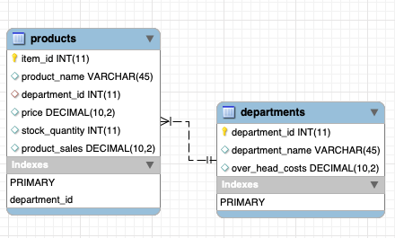

# bamazon


### Overview

In this assignment, a command line interface (CLI) node app was created which closely resembles *Amazon Market Place* . This app will take in orders from customers and adjust stock from the store's inventory. Additionally, the app tracks product sales across your store's departments and then provide a summary of the highest-grossing departments in the store. 

You can find the instructions for this assignment here: [homework-instructions.md](https://github.com/ekeoid/UNC-Bootcamp-2019-Class/blob/master/01-Class-Content/12-mysql/02-Homework/Instructions/homework_instructions.md)

Since this is a basic app, the items in to store are predefined with 10 items. The overall goal of this assignment was using node with a sql interface to process data.


### Technologies Used

- Node.JS [`runtime`](https://nodejs.org/en/docs/)
- MySQL [`database`](https://dev.mysql.com/doc/) [`npm-package`](https://www.npmjs.com/package/mysql)
- Inquirer [`npm-package`](https://www.npmjs.com/package/inquirer)
- cli-table [`npm-package`](https://www.npmjs.com/package/cli-table)
- dot-env [`npm-package`](https://www.npmjs.com/package/dot-env)

### Features

- **Customer view**
  1. Purchase item
- **Manager view**
  1. View all products
  2. View low inventory
  3. Add more of inventory
  4. Add new product
- **Supervisor view**
  1. View Products Sales by Department
  2. View All Departments
  3. Create New Department
  4. Remove Department

### Usage

##### Customer View


##### Manager View


##### Supervisor View


### Design

For the database design, since we include customer, manager, and supervisor views, multiple tables are related. The `products` table references the `departments` table by `department_id`. A `foreign key` is added to secure the relationship.

```mysql
CREATE TABLE products ( ... );
CREATE TABLE departments ( ... );

ALTER TABLE products
ADD FOREIGN KEY (department_id) REFERENCES departments(department_id);
```



### Challenges

- Calling a complex query with the Supervisor view we a challenge. There were multiple operations in the query command and any syntax errors, MySQL doesn't provide the best detail. Ultimately, my `GROUP BY` was missing `deaprtments` which was important. 

  ```mysql
  SELECT departments.department_id,
  			 department_name, 
  			 over_head_costs, 
  			 SUM(product_sales) AS 'product_sales',
  			 (SUM(products.product_sales) - departments.over_head_costs) AS 'total_profit'
  FROM departments
  INNER JOIN products
  ON departments.department_id = products.department_id
  GROUP BY department_name, departments.department_id, departments.over_head_costs
  ORDER BY department_name;
  ```

  

